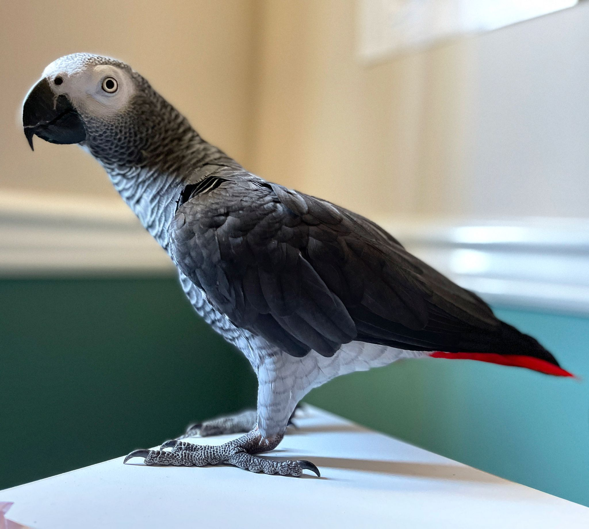

# YOLOv8 Object Detection Project

Welcome to the **YOLOv8 Object Detection Project**! This project uses the powerful YOLOv8 framework for detecting objects in images with high accuracy and efficiency.

---

## 🚀 Features

- **Easy Integration**: Plug-and-play object detection using YOLOv8.
- **Custom Models**: Support for your own trained YOLOv8 models (`yolo11n.pt`).
- **Bounding Box Visualization**: Displays detected objects with labels and confidence scores.
- **Customizable Confidence Threshold**: Control detection precision with configurable thresholds.
- **Supports OpenCV and Matplotlib**: Easy visualization and image manipulation.

---
## 📊 Results

Here’s an example of the model in action:

### Input Image

### Output Image

### Input Vedio

### Output Vedio

---
## 🧑‍💻 Author

**Aleena Treesa Leejoy**

- GitHub: [Nothing-atl](https://github.com/Nothing-atl)
